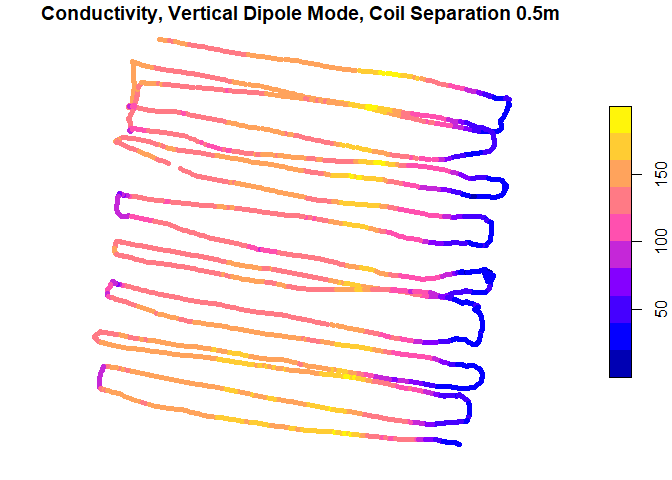

<!-- README.md is generated from README.Rmd. Please edit that file -->

[](https://travis-ci.com/obrl-soil/em38)
[](https://codecov.io/github/obrl-soil/em38?branch=master)
[](https://opensource.org/licenses/MIT)

em38
====

em38 translates \*.n38 binary files generated by the [Geonics EM38-MKII
ground conductivity meter](http://geonics.com/html/em38.html), commonly
used in soil research and precision agriculture. EM38-MKII devices are
supported by an official translation app called DAT38MK2, but this lacks
a command-line interface and is not easy to use in a reproducible
workflow.

Installation
------------

Install from github with

``` r
library(devtools)
install_github("obrl-soil/em38")
```

This package is in early development phase. Improving its reliability
requires access to a wide variety of test datasets, so if you have an
\*.n38 file that fails to decode correctly, please consider sending it
to me. I have been able to test decoding on around 50 sample files from
two different EM38-MKII devices, but could always use more. The device
and its logger have a large number of possible setting combinations, and
I have not seen all of them. Additionally, a third-party GPS needs to be
attached to the device and its data-logger, and GPS output data are
notoriously variable by brand and model.

Usage
-----

em38 is accompanied by a demo dataset gathered during a training
exercise:

``` r
library(em38)

# all-in-one wrapper function:
demo_survey  <- em38_from_file(path = system.file("extdata", "em38_demo.n38", 
                                                  package = "em38"),
                               hdop_filter = 3)


# Plot spatialised output of survey line 1 (calibrated conductivity for coil
# separation 0.5m)
sl1 <- demo_survey$survey_lines[[1]]
plot(sl1[sl1$mode == 'Vertical', 'cond_05'], pch = 20, 
     main = 'Conductivity, Vertical Dipole Mode, Coil Separation 0.5m')
```



Its surprisingly difficult to walk in a straight line across a paddock
:no\_mouth:

If you want to look at the intermediate data more closely,

``` r
# import binary file as raw() type matrix
n38_mat     <- n38_import(system.file("extdata", "em38_demo.n38", package = "em38"))
# break matrix into sections according to file spec 
n38_chunks  <- n38_chunk(n38_mat)
# decode matrix chunks into useable data
n38_decoded <- n38_decode(n38_chunks)
```

You can also create the equivalent of an \*.M38 text file, for
comparison.

``` r
m38_example <- n38_to_m38(n38_decoded)
# write to file as e.g.
#  write(m38_example, paste0('m38_from_R_', Sys.Date(), '.m38'))
```

------------------------------------------------------------------------
